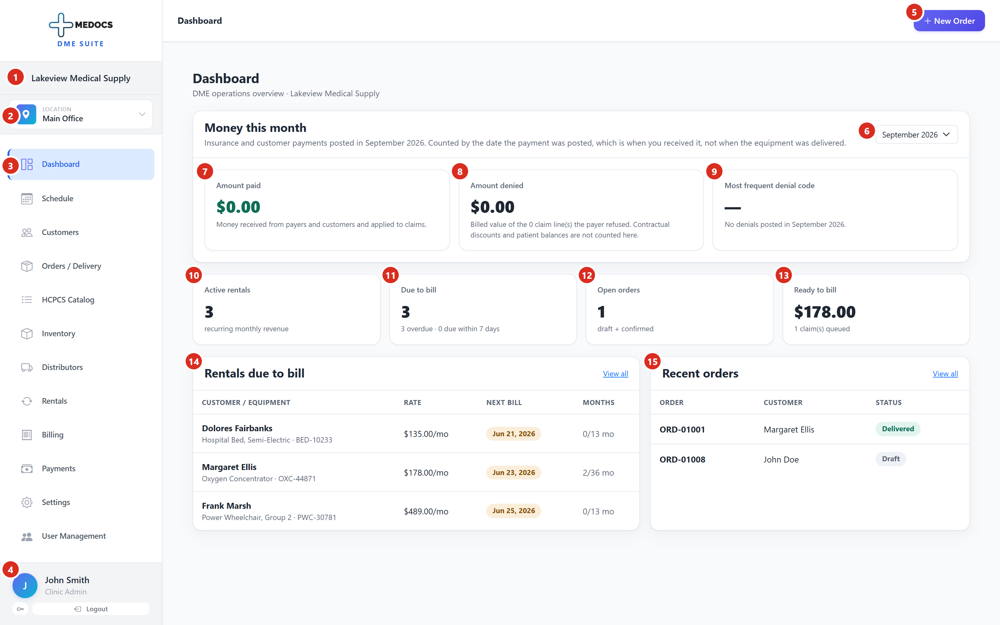

# The Dashboard

The Dashboard is the first screen you see after signing in. It answers one
question: **is anything going wrong today that costs money?**

It is a **read-only screen**. Nothing on it can be edited, and nothing on it is
stored. Every number is counted fresh from your orders, rentals, claims and
payments at the moment the page loads. If a figure looks wrong, the fix is
never on this screen. It is in the record the figure was counted from.

---

## The sidebar

### 1. Your company name

The supplier you are signed in as. If you work for one company, this never
changes.

### 2. Branch

The branch, or location, you are currently looking at. **Everything else on the
screen is filtered to this branch.** Click it to switch.

Choosing **All branches** shows the whole company rolled up together. If a
number looks smaller than you expect, check here first. It is the single most
common reason a figure looks wrong.

### 3. Navigation

The screens you can reach. They are in **working order, top to bottom**, not
alphabetical order. A new member of staff can work down the list.

Some items only appear for administrators. If a colleague cannot see
**Distributors**, **Settings** or **User Management**, that is their permission
level, not a fault.

### 4. Who you are signed in as

Your name and your role. **Log out** is here.

The session ends automatically after **15 minutes** of inactivity, which is a
patient privacy requirement and cannot be turned off.

---

## The header

### 5. New Order

The one action on this screen. It starts a new order for a customer, and it is
available from every page in the product, not only this one.

---

## Money this month

These three figures answer an accountant's question, not an operations
question. They are counted **by the date the payment was posted**, which is when
you received the money, so they reconcile against a bank statement for the same
period. They are **not** counted by the date the equipment was delivered.

### 6. Month selector

Changes which month all three figures below cover. It goes back twelve months.

### 7. Amount paid

Money received from insurers and from customers **and applied to claims**.

> **Read this before you report it as a bug.** This figure counts money that has
> been matched to specific claim lines, not cheques that have arrived. If a
> cheque has been entered but not yet allocated, this tile reads low, and it is
> correct to do so: nobody yet knows which claim was paid.
>
> The **Payments** screen shows the gap as **Unapplied**. If Amount paid looks
> too low, go and look there first.

### 8. Amount denied

The billed value of the claim lines the payer refused.

**Refused is not the same as unpaid.** Two things are deliberately excluded:

- **Contractual discounts.** The gap between what you charged and what the payer
  allows. You agreed to that when you signed the contract. It is not a denial.
- **Patient balances.** A deductible or a coinsurance amount is money the
  patient owes you. It is not a denial either, and chasing it as one wastes the
  week you had to appeal.

A line only counts here if the payer paid **nothing** for it **and** gave a
reason that puts the cost on you.

### 9. Most frequent denial code

The reason code that appeared most often this month. A dash means nothing was
denied.

This is a pattern detector. One denial is bad luck. The same code twenty times
usually means one document is missing from one kind of order, and fixing that
one thing clears the whole group.

---

## The four operational tiles

These are about today, not about the month. They are not filtered by the month
selector.

### 10. Active rentals

How many rental agreements are currently running. Each one bills again every
month, so this is your recurring revenue.

### 11. Due to bill

Rentals that need a claim raised. The line beneath splits it into two very
different problems:

- **Overdue** means the bill date has already passed. **This is money you have
  already lost this month.** It should normally be zero.
- **Due within 7 days** is a task for this week.

**If Overdue is not zero, that is the most important number on this screen.**
Go to **Rentals** and clear it. An unbilled rental month is not automatically
recoverable later: every payer has a deadline for filing a claim, and once it
passes the money is gone permanently.

### 12. Open orders

Orders raised but not yet delivered, in either **draft** or **confirmed** state.
This is your outstanding work.

### 13. Ready to bill

Claims that have been built and are waiting to be sent to the payer, and what
they are worth. The count is beneath the amount.

This is money you have earned and not yet asked for.

---

## The two panels

### 14. Rentals due to bill

The rentals behind tile 11, in date order, with the monthly rate and the month
number.

**How to read `2/36 mo`:** two months have been billed out of a thirty-six month
term. `0/13 mo` means nothing has been billed yet on a thirteen month term.

The term is not the same for every item. Most equipment runs **13 months**, and
at the end of it the equipment becomes the customer's property. Oxygen runs
**36 months** and stays yours. The software knows which applies from the item.

**View all** opens the Rentals screen.

### 15. Recent orders

The six most recent orders, whatever their status. A quick check on what has
been happening, not a work list.

**View all** opens the Orders screen.

---

## Frequently asked

**A number looks wrong. What do I check first?**
The branch (2). Then whether you are looking at the right month (6).

**Amount paid is lower than the cheques we banked.**
Correct behaviour. See tile 7. Check **Unapplied** on the Payments screen.

**Why is Amount denied zero when a payer clearly underpaid us?**
An underpayment is usually a contractual discount, not a denial. See tile 8.

**Can I change anything on this screen?**
No. It only reads. The only button is New Order.

**Two of us see different numbers.**
Almost always different branches. Compare tile 2 first.
